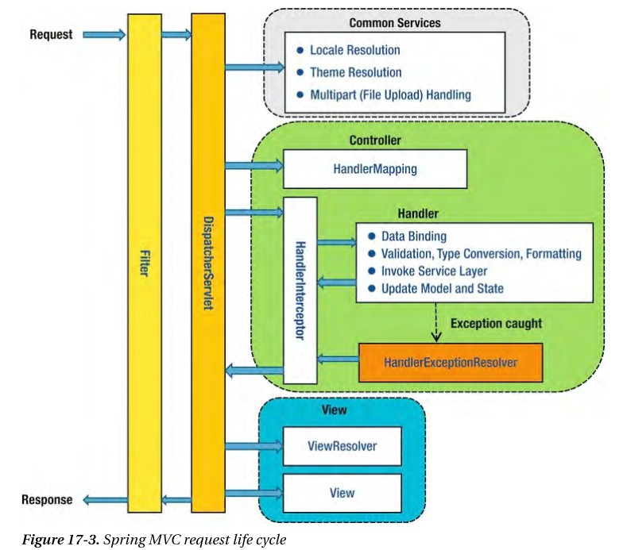

---

## 백엔드 API 요청/응답 시나리오

여기서는 API 방식으로 데이터를 주고 받는 것을 고려한다.

- 사용자에게 적절한 Http 요청을 받는다. 이때 필요한 데이터가 있다면 다음 방식으로 데이터를 받음.
  - Get 방식 : 쿼리 파라미터
  - 그 외 : MessageBody로 Json 데이터를 받음(content-Type : `application/json`)
- 요청을 분석하여 바인딩 Dto에 바인딩.
  - 쿼리 파라미터 바인딩은 `@ModelAttribute`로 바인딩 가능
  - JSON 바인딩은 `@RequestBody`로 가능.
    - 이때 일부 타입이 맞지 않다면, `HttpMessageConverter`의 파라미터 바인딩 과정에서, 예외가 발생해서 애초에 컨트롤러 호출이 되지 않는데... 이를 위한 예외처리를 해야한다.
  - 여러가지 이유로 모든 요청마다 다른 DTO에 바인딩하는게 좋다.
    - 도메인에 매핑하지 말 것(요청에 대한 검증을 위한 로직이 도메인에 섞이게 됨, 도메인 사양이 바뀌면 요청API 사양도 변경됨, ...)
- 적절한 로직을 수행하고 API로 응답을 해야하는데 여기까지 과정이 항상 정상적일 수가 없다.
  - 성공 요청 : 올바른 데이터가 입력됐을 때 성공 로직을 수행하고 성공 결과 API를 응답
  - 실패 요청 : JSON을 객체로 생성하는 것 자체가 실패했을 때. 즉, 컨트롤러가 호출되기도 전에 예외가 발생한 상황.
  - 검증 오류 요청 : 컨트롤러 너머의 검증로직에서 예외가 발생했을 때.
- **성공했을 때의 API뿐만 아니라, 바인딩 실패/검증 오류 상황 모두에 대한 API 명세를 정해두고 모든 상황의 결과를 JSON으로 응답할 수 있어야한다.**
  - 성공 : 응답 데이터
  - 실패 : 상태코드, 메시지, ...

---

## Spring MVC의 구조

- 서블릿 필터
- DispatcherServlet(프론트 컨트롤러, 이후 서블릿으로 칭함)
- 핸들러 맵핑, 핸들러 어댑터
  - ArgumentResolver, HttpMessageConverter
  - returnValueHandler
- 뷰 리졸버, 뷰
- 스프링 인터셉터
- 컨트롤러

---

## SpringMvc 요청/응답의 흐름
- Dispatcher 서블릿은 요청을 받고 HandlerMapping을 통해 핸들러(Controller)를 조회한다.
- HandlerAdapter 목록을 찾아서, 처리할 수 있는 핸들러 어댑터를 조회한다.
- 핸들러 어댑터 호출 전에, 스프링 인터셉터의 `preHandle`을 호출
  - preHandle의 응답값이 true이면 다음으로 진행하고 false이면 더 이상 진행하지 않음
- 핸들러 어댑터 실행(handle)
  - 핸들러 어댑터는 ArgumentResolver의 supportParameter()를 호출하여 해당 파라미터를 지원하는지 여부를 확인하고, 지원하면 resolveArgument() 메서드를 호출해서 실제 객체를 생성.
    - 이때, Http 메시지 바디에 데이터가 넘어온 경우(`@RequestBody`, HttpEntity) HttpMessageConverter에 위임
  - 이렇게 생성된 객체가 컨트롤러 호출 시 넘어감.
- 핸들러(컨트롤러) 실행
- returnValueHandler에 의해 컨트롤러의 반환값이 다른 형태로 변환됨
  - 이때 `@ResponseBody` 어노테이션이 있을 경우 또는 `HttpEntity`의 경우 `HttpMessageConverter`에 의해 JSON 응답으로 변환됨
- 핸들러 어댑터는 returnValueHandler에게 반환값을 전달받고 서블릿에 전달
- 스프링 인터셉터의 `postHandle`이 호출
  - 예외가 발생했다면 호출되지 않음
- 결과를 View에 담아야 하는 경우 ViewResolver를 통해 View를 조회
- View는 render를 호출하여 Html 문서를 받음
- View에 담지 않아도 되는 경우 그대로 Http 응답(API), 그렇지 않다면 렌더링된 Html 문서를 응답
- 응답이 나간 직후(API 응답, 뷰 렌더링 응답) 스프링 인터셉터의 `afterCompletion` 호출
  - **이하의 과정에서 예외가 발생했을 경우에도 반드시 호출된다.**
  - 즉, 적절한 예외처리를 여기서 하면 된다.

---

## 주로 예외가 발생하는 지점?
- 요청 바인딩 실패
  - JSON을 컨트롤러의 파라미터 객체(주로 DTO)로 바인딩하는 과정에서 HttpMessageConverter가 개입하는데 이 과정에서 예외가 발생하면 컨트롤러가 호출되기도 전에 예외가 터져버림.
- 컨트롤러 너머의 로직에서 예외 발생

---

## 예외의 전파 및 스프링부트의 기본적인 API 예외 처리
> WAS(전파) <- 필터 <- 서블릿 <- 인터셉터 <- 컨트롤러

> WAS(오류확인, /error 내부 재요청) -> 필터 -> 서블릿 -> 인터셉터 -> 컨트롤러

- 별다른 예외 처리를 하지 않고, WAS까지 전파됐을 경우 WAS는 오류를 확인하고 내부적으로 에러페이지 또는 에러 응답 API를 재요청함.
- 스프링부트는 기본적으로 `BasicErrorController`를 자동으로 등록해둠.
  - 기본적으로 예외가 발생되거나, `request.sendError` 등으로 서블릿 밖으로 예외가 전파되면,  `/error`로 재요청
    - Accept 헤더값이 text/html일 경우, errorHtml()을 호출해서 기본 예외 view 제공
    - Accept 헤더값이 그 이외의 경우, error()을 호출해서 ResponseEntity에 예외정보 및 상태코드를 담아 JSON 데이터로 반환
- 한계
  - 각 컨트롤러마다, 각 API마다, 각 예외상황마다 제각기 다른 응답결과를 표현하기 힘듬.
  - API 통신은 각 요청마다 세밀하게 다른 응답을 하는게 중요한데 이는 `@ExceptionHandler`, `@ControllerAdvice`를 사용하는 것이 낫다.

---

## 요청 DTO를 검증하기

- ver 1 : 컨트롤러에서 명시적으로 요청에 대한 검증로직을 작성하기
  - 명시적으로 HashMap과 같은 자료구조에 예외를 저장한 뒤 이를 모아 적절하게 가공하여 응답
- ver 2 : 컨트롤러에서 명시적으로 요청에 대한 검증로직을 작성하고 BindingResult에 예외를 모으기
  - BindingResult : 스프링이 제공하는 검증오류를 보관하는 인터페이스. Errors 인터페이스를 상속하고 있음. Errors는 단순 오류 저장, 조회 기능을 제공하는데 BindingResult는 여기에 추가적인 기능을 더 많이 제공함.
  - 특정 필드에 해당하는 오류는 FieldError로 생성해서 넣고, 글로벌 오류(여러 필드에 걸쳐 검증했을 시 유효하지 맞지 않는 것들)는 ObjectError로 생성해서 넣기
  - `@ModelAttribute`로 바인딩 시, 객체 타입 오류 등으로 바인딩이 실패하는 경우 스프링이 BindingResult에 FieldError를 생성해서 넣어줌.
- ver 3 : 요청 Dto를 검증하기 위한 객체(Validator 구현체)를 별도로 생성하고 검증 책임을 이곳에 위임하기
  - 컨트롤러에 직접 검증을 위한 코드를 길게 작성하지 않고, 요청 Dto의 검증을 처리하는 Validator 구현체를 빈으로 등록한 뒤 컨트롤러에 의존관계를 주입한다. 이후 컨트롤러에서는 해당 Validator를 호출하여 검증을 위임한다.
- ver 3-1 : validator를 직접호출하지 않고 WebDataBinder에 검증기를 추가하기
  - 컨트롤러에 검증기 WebDataBinder를 초기화하는 로직을 추가(`@InitBinder`)
    - 컨트롤러에서 초기화하므로 이 검증기는 해당 컨트롤러 내에서만 유효하다. 
  - 검증기에 Validator 구현체를 수동으로 추가
  - 검증하고 싶은 Dto 파라미터 앞에 `@Valid` 또는 `@Validated`를 사용하면 해당 검증기에서 등록된 Validator를 찾아서 검증을 실행해줌
    - `@Valid`는 자바 표준, `@Validated`는 스프링 전용
- ver 3-2 : 글로벌로 validator 등록하기
  - WebMvcConfigure 인터페이스를 구현한 구현체를 빈으로 등록한 뒤, `getValidator()` 인터페이스를 구현함. 여기에 Validator를 추가해주면 됨.
  - 하지만 이 방식을 쓰면 아래에서 사용할 `BeanValidator`가 자동으로 등록되지 않아 실무에서 잘 쓰지 않음.
- ver 4 : Bean Validation
  - 실무에서 가장 많이 사용되는 검증방식
  - Spring Validation을 쓸 경우 요청 Dto에 적절한 어노테이션을 달아서 검증을 수행할 수 있음.
    - 스프링에서는 `LocalValidatorFactoryBean`을 글로벌 Validator로 등록함
    - 컨트롤러 메서드에서, 검증 Dto 앞에 `@Validate` 또는 `@Valid`를 달면 글로벌 Validator가 BeanValidation을 수행해주고, 검증 Dto 뒤에 BindingResult를 파라미터로 달아주면 바인딩 오류를 담아줌.
  - 오브젝트 오류는 `@ScriptAssert` 어노테이션을 Dto에 달아서 처리하는 방법도 있긴한데, 생각보다 검증의 제약이 많고 복잡한 경우가 많아짐. 보통은 오브젝트 오류(글로벌 오류)는 직접 자바코드로 작성함.

---
